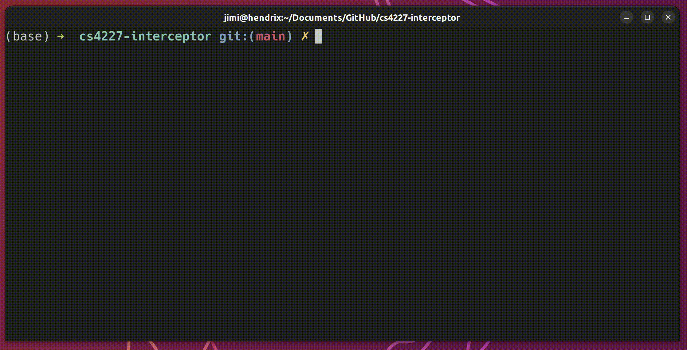
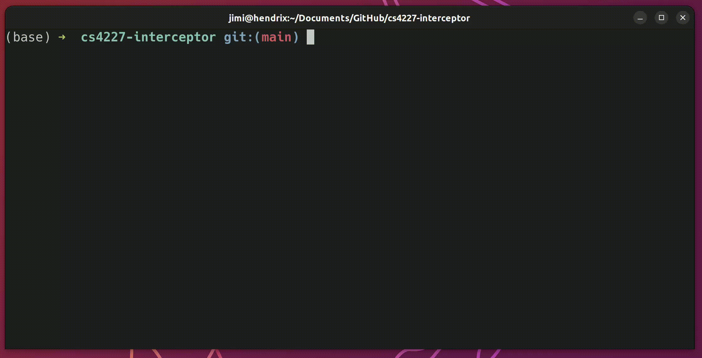

# Interceptor

## Description

The event that is intercepted is `measurementsChanged()`. When this is intercepted, the MeasurementsChangedLogger's intercept() method is called. This method logs the measurements to the console.


## Build

```npm install```  
```npm run build```



## Run

```npm start```



## Test

```npm run test```


## Run in dev mode

```npm run dev```